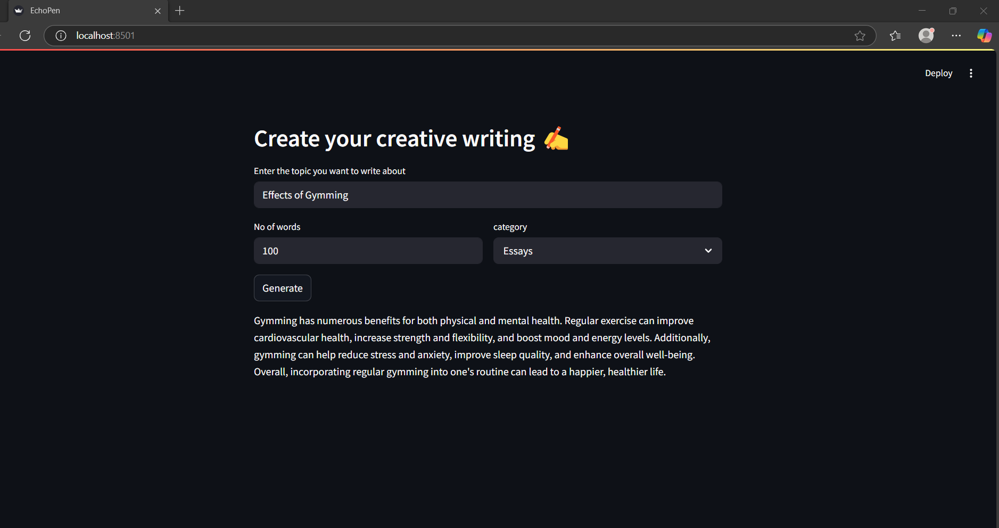

# EchoPen - Llma

### Project Overview
 This is a basic project that helps you to start with building local LLM application, utilizing the Llama-2-7B model as its backbone, yet it's fully adaptable to any LLM framework. It serves as a prototype for a creative writer application, generating articles from user-defined topics. Its core functionality—prompt-based response generation from the LLM—enables the development of a tons of applications by simply altering the prompts.

----------------------------------

### How to run

1. **Repository Cloning**: Clone the repository to initiate your local setup.
2. **Download Model**: Download LLM model from the [HuggingFace](https://huggingface.co/models) and save it in `/models`
   > Download link: (https://huggingface.co/BashitAli/llama-2-7b-chat.ggmlv3.q5_K_M)
4. **Virtual Environment**: Establish an isolated environment for dependency management
   ```
   conda create -p env_name python==3.9 -y
   ```

   ```
   activate env_name
   ```

5. Dependency Installation: Install necessary dependencies using `requirements.txt`
   ```python
   pip install -r requirements.txt
   ```
6. **Application Initialization**: Launch the application through Streamlit
   ```python
   streamlit run app.py
-------------------------------------------

### Sample Screenshot from the app



-----------------

### Disclaimer

*Running Local LLMs is super slow if you have basic system config.(Basic RAM/GPU)*
